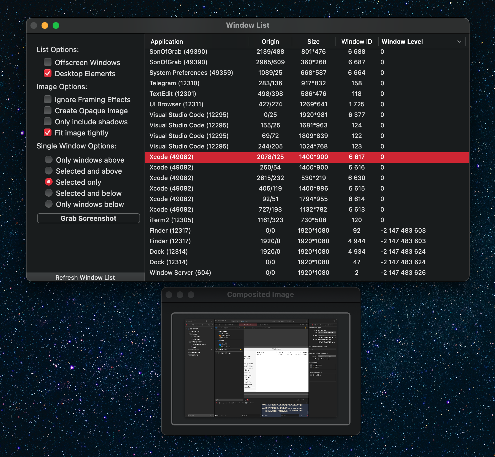

# Son of Grab

Son of Grab demonstrates the CGWindow API to grab the contents of arbitrary sets of windows.

The core of this sample are 5 methods on the Controller class, described below.

### `-[Controller updateWindowList]`
This method gets the current list of windows from the window server. Options in the GUI allow you to exclude offscreen windows and desktop elements. The list returned from the window server is further processed (via the WindowListApplierFunction callback) to produce the list that is presented in the GUI.

### `-[Controller createSingleWindowShot:]`
Creates a screen shot relative to the single CGWindowID that is passed in. Depending on the "Single Window Options" specified in the GUI, the screen shot may include any number of other windows and may or may not include the window actually passed to this method.

### `-[Controller createMultiWindowShot:]`
Creates a screen shot with exactly those windows passed in.

### `-[Controller createScreenShot]`
Creates a screen shot from all of the windows that are currently onscreen and readable.

## IMPORTANT

The CGWindow API is capable of dealing with common issues that you may come across in practice, generally returning NULL if it is not possible to contact the Window Server, or a full transparent image when it is not possible to compose an image from the list given. The comments in CGWindow.h go into great detail on the corner cases and other issues that you may find in using this API and is invaluable in understanding what will happen in many common use cases.

## PERFORMANCE

The CGWindow API provides CGImageRef's that whose backing data is created on demand by the window server when first rendered, and as such you can request a large number of images without taking a performance hit until the image is rendered. If you are capturing a large number of images, you will see the time required to create those images spent in the WindowServer process, and you should be aware that while CGWindowListCreateImage will return quickly. Drawing the image for the first time is likely to consume more time than you might expect for an image from other sources.

The sample code can be configured to time its operations by setting the PROFILE_WINDOW_GRAB to 1. This macro's definition is defaulted to 0 in the Controller.m source file.

## FURTHER INFORMATION

For more information about the CGWindow API, refer to the "Quartz Window Services" Reference (<https://developer.apple.com/documentation/coregraphics/quartz_window_services?language=objc>).
